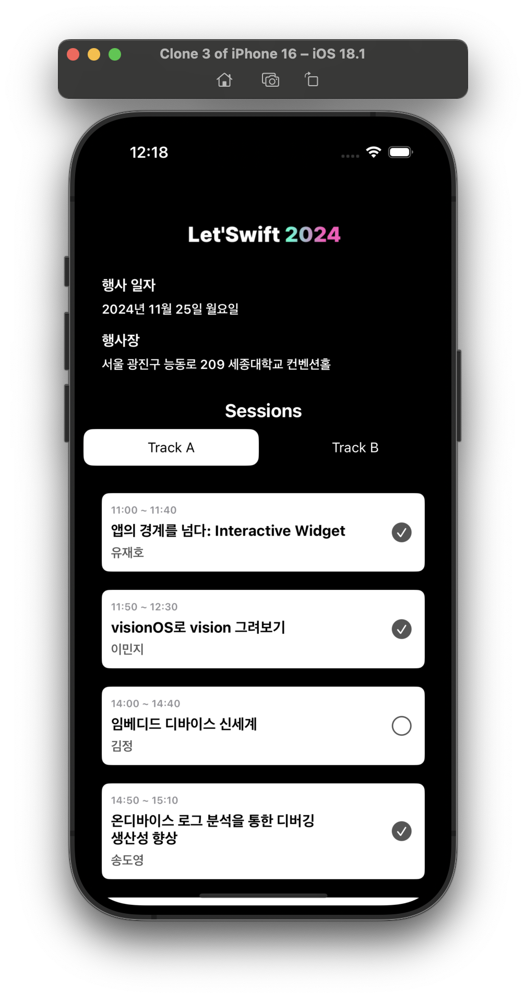
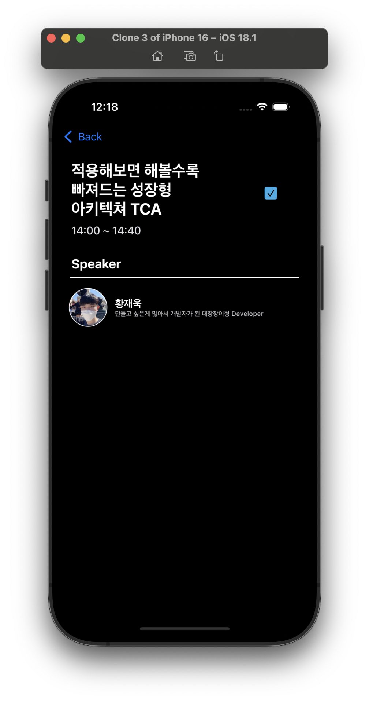

## Let'Swift 2024 Light ver. App

Let'Swift 2024 발표 세션들에 대한 정보를 간단하게 보여주는 앱으로
[TCA(The Composable Architecture)](https://github.com/pointfreeco/swift-composable-architecture) 아키텍쳐로 구성되어 있습니다.

Let'Swift 2024 [적용해보면 해볼수록 빠져드는 성장형 아키텍쳐 TCA](https://letswift.kr/2024/) 발표에서 기본적인 TCA 구조와 구성요소 설명을 위해 구현한 2가지 화면으로 구성된
간단한 앱입니다.

---

## Environment
|OS|Xcode version|iOS|
|----------|----------|----------|
|15.1/Sequoia with M2 Max|Xcode 16.1|17.0

## ScreenShots 

### 메인 화면 - MainReducer, MainViewController

간단한 트랙별 발표 세션 시간 정보 및 타이틀 정보

### 세션 상세 화면 - SessionDetailReducer, SessionDetailViewController

발표 세션 정보 및 Speaker 정보

